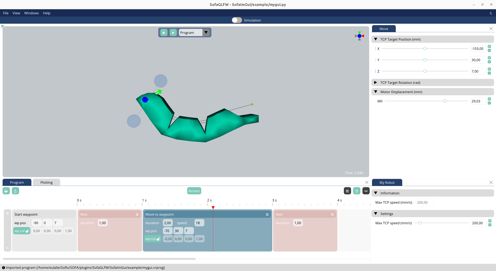

# SofaGLFW

This SOFA plugin brings a simple GUI based on GLFW (a spiritual successor of Glut).

Lastly, this GUI was designed to support multiple windows in the same time and multiple simulations. 

## Dependencies

### Linux

Unix-like systems such as Linux need a few extra packages for GLFW. Read the documentation on the [GLFW website (section `Installing dependencies`)](https://www.glfw.org/docs/latest/compile_guide.html).
**For example**, if you are on Ubuntu running X11, you need to do:

```
sudo apt install xorg-dev
```

### Others

No dependencies

## Compilation

As any plugin, to compile SofaGLFW, follow the instructions on the [SOFA documentation website](https://www.sofa-framework.org/community/doc/plugins/build-a-plugin-from-sources/).

# Dear ImGui

By default, SofaGLFW does not show any user interface.
Only the keyboard allows limited interactions with the simulation.
That is why a user interface based on [Dear ImGui](https://github.com/ocornut/imgui) is provided, in the form of a SOFA plugin.

By default, this interface is not compiled.
The CMake variable `PLUGIN_SOFAIMGUI` must be set to `ON`.

Integration of Dear ImGui is automatic (automatic fetching and integration with CMake), and linked statically.

## Dependencies

SofaImGui depends on SofaGLFW, so it must also be activated.

The GUI relies on the [NFD-extended library](https://github.com/btzy/nativefiledialog-extended).
Therefore, it comes with its dependencies. See the list on [GitHub](https://github.com/btzy/nativefiledialog-extended#dependencies).

## Compilation

As any plugin, to compile SofaImGui, follow the instructions on the [SOFA documentation website](https://www.sofa-framework.org/community/doc/plugins/build-a-plugin-from-sources/).

## Usage

To run SOFA with the GUI from SofaImGui, execute the following command:

```bash
runSofa -l SofaImGui -g imgui
```

- `-l SofaImGui`: loads the plugin in order to be able to use the GUI (see the [documentation](https://www.sofa-framework.org/community/doc/plugins/what-is-a-plugin/))
- `-g imgui`: selects the `runSofa` GUI to be the one from SofaImGui

It is possible to run the Dear ImGui-based GUI by default when running the command `./runSofa` (without the `-l` and `-g` arguments). To do so, add the SofaImGui plugin into the list of loaded plugin in the `plugin_list.conf` file (see the [documentation](https://www.sofa-framework.org/community/doc/plugins/what-is-a-plugin/)). Then, run `runSofa -g imgui` at least once so that `runSofa` save the last used GUI. After that, `./runSofa` will load the imgui GUI.

## Windows

The GUI is based on dockable windows.
Each window gathers related features. 
Here are all the available windows:

| Window             | Description                             |
|--------------------|-----------------------------------------|
| __Move__           | Direct control of the TCP target        |
| __Input / Output__ | ROS                                     |
| __Program__        | A tool to program the robot             |
| __My Robot__       | Robot's information and settings        |
| __Plotting__       | A tool to plot data from the simulation |


## Screenshots


